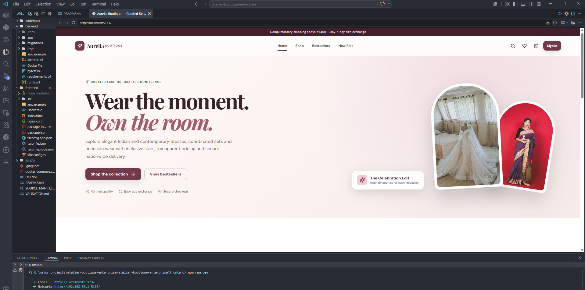

# Aurelia Boutique Enterprise

A complete boutique fashion commerce project with a premium React storefront, FastAPI backend, protected administrator panel, size-and-colour inventory, checkout, orders, promotions, customer management, content controls, PostgreSQL deployment assets and seeded demonstration data.



## Core capabilities

### Customer storefront

- Responsive boutique landing page, editorial sections, collections and product catalogue
- Search by style, brand, fabric, SKU or occasion
- Collection, size, colour, featured, bestseller, price and sorting filters
- Detailed garment pages with fabric, fit, care, occasion and gallery information
- Size-and-colour selection backed by real variant inventory
- Registration, JWT authentication and persistent sessions
- Shopping bag with server-side SKU and stock validation
- Coupons with minimum-order and maximum-discount rules
- Cash on delivery and mock secure-card checkout
- Optional gift note, order history and fulfilment tracking
- Product ratings and review API
- Mobile, tablet and desktop layouts

### Administrator panel

- Role-protected enterprise operations workspace
- Revenue, recent revenue, orders, customers, styles, variants and inventory KPIs
- Product/style create, update, publish, feature, bestseller and delete controls
- Variant management for size, colour, SKU, stock and additional price
- Low-stock visibility at variant level
- Collection creation and catalogue organisation
- Promotion creation with discount percentage, minimum order and discount cap
- Order workflow: pending, confirmed, tailoring, packed, shipped, delivered, cancelled and returned
- Customer activation and suspension
- Editable announcement, homepage, support and exchange-policy content
- Administrative audit-log persistence

### Engineering foundation

- React 19, TypeScript, Vite, React Router and Lucide icons
- FastAPI, SQLAlchemy 2, Pydantic 2, JWT and Argon2
- SQLite for zero-configuration local development
- PostgreSQL production configuration
- Alembic initial migration and migration scripts
- Docker Compose with PostgreSQL, FastAPI and Nginx
- Request IDs, security headers, CORS and role-based access control
- Seeded boutique collections, garments and variants
- Automated end-to-end commerce workflow test
- Windows, Linux and macOS setup/start scripts

## Project structure

```text
atelier-boutique-enterprise/
├── backend/
│   ├── app/api/              # Auth, catalogue, cart, checkout, orders and admin
│   ├── app/core/             # Configuration and security
│   ├── app/db/               # SQLAlchemy engine and sessions
│   ├── app/models/           # Users, products, variants, orders and audit entities
│   ├── app/schemas/          # Pydantic API contracts
│   ├── app/services/         # Product serialization and domain helpers
│   ├── migrations/           # Alembic environment and initial migration
│   └── tests/                # Complete boutique purchase/admin workflow test
├── frontend/
│   └── src/
│       ├── components/       # Layout and reusable product cards
│       ├── context/          # Authentication and shopping-bag state
│       ├── pages/            # Storefront, product, cart, orders and admin
│       ├── services/         # Typed API client
│       └── types/            # Shared TypeScript contracts
├── scripts/
├── docker-compose.yml
└── VALIDATION.md
```

## Windows setup

Open PowerShell inside the extracted project folder:

```powershell
Set-ExecutionPolicy -Scope Process Bypass
.\scripts\setup-windows.ps1
```

Run the database migration:

```powershell
.\scripts\migrate-db.ps1
```

Start the backend in terminal 1:

```powershell
.\scripts\start-backend.ps1
```

Start the frontend in terminal 2:

```powershell
.\scripts\start-frontend.ps1
```

Open:

- Storefront: `http://localhost:5173`
- Administrator panel: `http://localhost:5173/admin`
- API documentation: `http://localhost:8000/docs`
- Health check: `http://localhost:8000/health`

## Linux or macOS setup

```bash
chmod +x scripts/*.sh
./scripts/setup-linux.sh
./scripts/migrate-db.sh
./scripts/start-backend.sh
```

In another terminal:

```bash
./scripts/start-frontend.sh
```

## Demo administrator

```text
Email: admin@aureliaboutique.com
Password: ChangeMe123!
```

Change the default password and backend `SECRET_KEY` before any public deployment.

## Product variant format in admin

The style editor accepts one variant per line:

```text
S|Rosewood|10|0|AA-AN-1001-RW-S
M|Rosewood|12|0|AA-AN-1001-RW-M
L|Wine|8|100|AA-AN-1001-WN-L
```

Fields are: `size | colour | stock | additional price | optional SKU`.

## Docker deployment

```bash
docker compose up --build
```

Open `http://localhost:8080`.

The backend container runs `alembic upgrade head` before starting FastAPI. The stack includes PostgreSQL, FastAPI, an Nginx-served React application and an `/api` reverse proxy.

## Quality checks

Backend:

```bash
cd backend
.venv/bin/ruff check app tests
PYTHONPATH=. .venv/bin/pytest -q
DATABASE_URL=sqlite:///./migration_test.db .venv/bin/alembic upgrade head
```

Frontend:

```bash
cd frontend
npm run build
npm audit --omit=dev
```

## Production hardening checklist

1. Replace all default credentials and secrets.
2. Use HTTPS, a managed load balancer and a web application firewall.
3. Use managed PostgreSQL with automated backups and point-in-time recovery.
4. Integrate a real payment provider using signed server-side webhooks.
5. Store garment media in object storage behind a CDN and image optimiser.
6. Integrate shipping labels, courier tracking, invoices, taxes, returns and refunds.
7. Add email, SMS or push notifications for order workflow events.
8. Add rate limiting, metrics, tracing, centralised logs and alerting.
9. Add reservation expiry for high-concurrency inventory and idempotency keys for checkout.
10. Perform accessibility, penetration, load, recovery and mobile-browser testing.

## Payment note

The included `mock_card` method demonstrates a successful payment state but does not charge real money. Cash on delivery is also supported. Replace the mock flow with a production payment gateway before launch.
